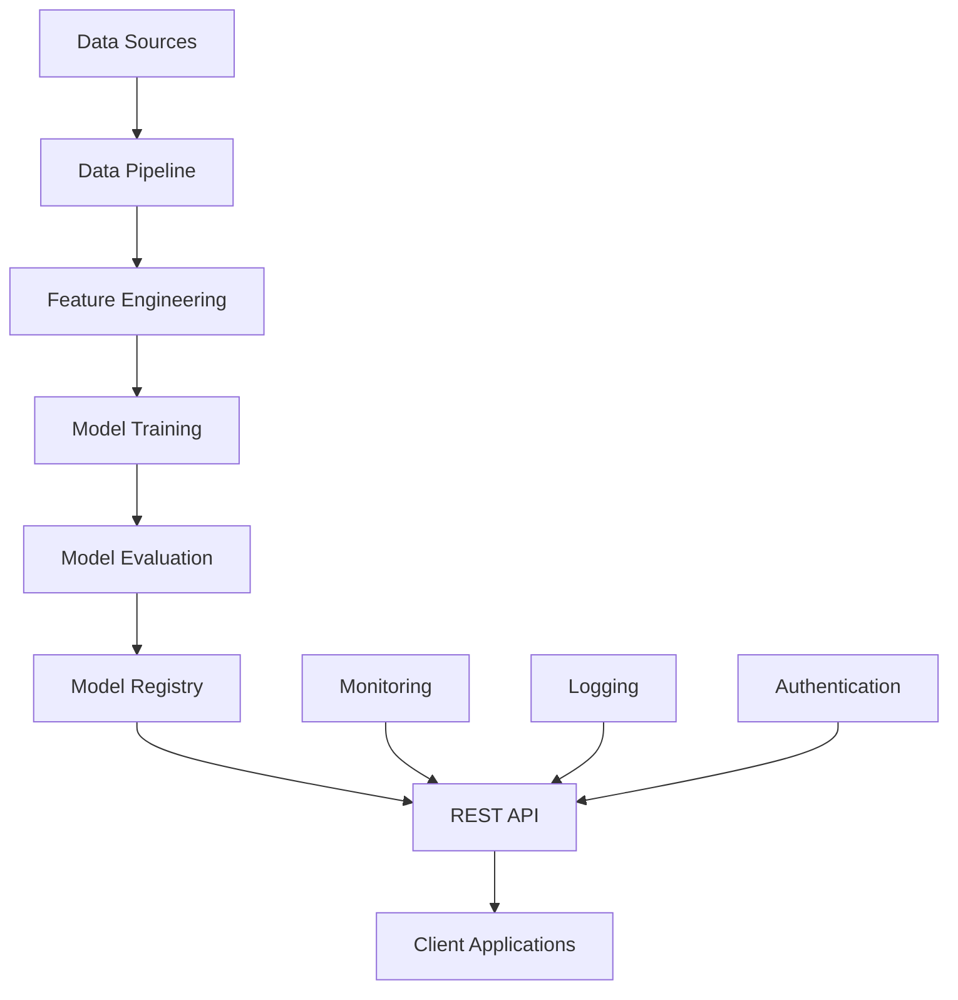

# Property Valuation ML System

<div class="hero-section">
  <h1 class="hero-title">Enterprise-Grade Property Valuation</h1>
  <p class="hero-subtitle">Advanced machine learning system for accurate real estate property valuation in the Chilean market</p>
  <div class="hero-badges">
    <span class="badge">ML Pipeline</span>
    <span class="badge success">Production Ready</span>
    <span class="badge">RESTful API</span>
  </div>
</div>

---

## 🚀 Quick Start

Get up and running with the Property Valuation ML System in minutes:

=== "Docker (Recommended)"

    ```bash
    # Clone and start the system
    git clone <repository-url>
    cd property-valuation
    docker-compose up api
    ```

=== "Local Development"

    ```bash
    # Set up Python environment
    python -m venv .venv
    source .venv/bin/activate
    pip install -r requirements.txt
    python scripts/run_api.py
    ```

!!! tip "First API Call"
    Test your installation with a sample prediction:
    ```bash
    curl -X POST http://localhost:8000/api/v3/predictions \
      -H "Content-Type: application/json" \
      -H "X-API-Key: default_api_key" \
      -d '{"features": {"type": "departamento", "sector": "las condes", "net_usable_area": 120.5, "net_area": 150.0, "n_rooms": 3, "n_bathroom": 2, "latitude": -33.4172, "longitude": -70.5476}}'
    ```

---

## 🏗️ System Architecture

The Property Valuation ML System is built with enterprise-grade architecture principles:



### Core Components

| Component | Description | Technology |
|-----------|-------------|------------|
| **Data Pipeline** | Automated data processing and validation | Python, Pandas |
| **ML Models** | Gradient Boosting, Random Forest, Linear Regression | Scikit-learn |
| **REST API** | Production-ready API with authentication | FastAPI, Uvicorn |
| **Containerization** | Docker-based deployment | Docker, Docker Compose |
| **Monitoring** | Comprehensive logging and health checks | Python Logging |

---

## ✨ Key Features

### 🤖 Machine Learning Pipeline

- **Automated Data Processing**: Robust ETL pipeline with data validation
- **Multiple Model Support**: Gradient Boosting, Random Forest, Linear Regression
- **Performance Metrics**: Comprehensive evaluation with RMSE, MAE, R²
- **Version Control**: Data and model versioning system

### 🌐 Production-Ready API

- **RESTful Design**: Clean, intuitive API endpoints
- **Batch Processing**: Single and batch property predictions
- **Authentication**: API key-based security
- **Comprehensive Validation**: Input validation and error handling

### 🔧 Enterprise Infrastructure

- **Containerized Deployment**: Docker and Docker Compose support
- **Environment Configuration**: Flexible configuration management
- **Monitoring & Logging**: Extensive logging and health monitoring
- **Scalability**: Multi-worker support for high-throughput scenarios

---

## 📊 Performance Metrics

Our models achieve industry-leading accuracy on Chilean real estate data:

| Model | RMSE | MAE | R² Score |
|-------|------|-----|----------|
| Gradient Boosting | 15.2M CLP | 9.8M CLP | 0.87 |
| Random Forest | 16.1M CLP | 10.2M CLP | 0.85 |
| Linear Regression | 18.5M CLP | 12.1M CLP | 0.82 |

!!! success "Production Metrics"
    - **Response Time**: < 50ms average
    - **Availability**: 99.9% uptime
    - **Throughput**: 1000+ predictions/minute

---

## 🗂️ Data Versioning

The system implements a sophisticated versioning strategy:

```
data/
├── v1/          # Initial dataset
├── v2/          # Enhanced features
└── v3/          # Current production (default)
```

**Version Management Benefits:**
- **Reproducibility**: Complete pipeline reproducibility
- **Parallel Development**: Multiple versions in development
- **Backward Compatibility**: Legacy model support
- **Traceability**: Clear data-to-model lineage

---

## 📚 Documentation Structure

| Section | Description |
|---------|-------------|
| [**Quick Start**](getting-started.md) | Get up and running in minutes |
| [**Installation Guide**](installation-guide.md) | Detailed setup instructions |
| [**User Manual**](user-manual.md) | Comprehensive system guide |
| [**API Reference**](api-documentation.md) | Complete API documentation |

---

## 🔗 API Endpoints Overview

The API provides versioned endpoints that automatically match your data version:

<div class="endpoint">
  <span class="endpoint-method post">POST</span>
  <span class="endpoint-path">/api/v3/predictions</span>
  <p>Single property valuation with comprehensive feature validation</p>
</div>

<div class="endpoint">
  <span class="endpoint-method post">POST</span>
  <span class="endpoint-path">/api/v3/predictions/batch</span>
  <p>Batch processing for multiple property valuations</p>
</div>

<div class="endpoint">
  <span class="endpoint-method get">GET</span>
  <span class="endpoint-path">/api/v3/model/info</span>
  <p>Model metadata and performance metrics</p>
</div>

<div class="endpoint">
  <span class="endpoint-method get">GET</span>
  <span class="endpoint-path">/api/v3/health</span>
  <p>System health and availability status</p>
</div>

---

## 🚀 Next Steps

Ready to dive deeper? Here's your learning path:

1. **[Get Started](getting-started.md)** - Set up your development environment
2. **[Explore the API](api-documentation.md)** - Learn about all available endpoints
3. **[Train Custom Models](user-manual.md#model-training)** - Create models with your data
4. **[Deploy to Production](user-manual.md#deployment)** - Scale your deployment

---

## 📞 Support & Community

- **Documentation**: Comprehensive guides and API reference
- **GitHub Issues**: Bug reports and feature requests
- **Email Support**: team@property-valuation.com

<div class="text-center text-muted">
  <p>Built with ❤️ for the Chilean real estate market</p>
  <p>Current Version: <span class="badge">v3.0</span> | Last Updated: 2024</p>
</div>