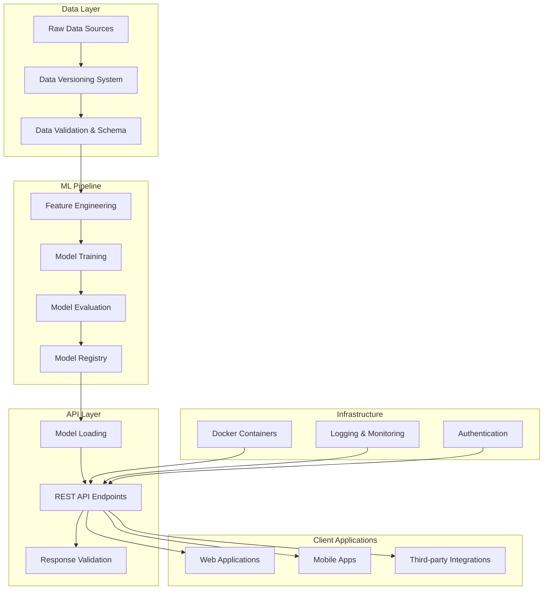

# User Manual

Comprehensive guide to the Property Valuation ML System - from basic usage to advanced configuration.

---

## 🏗️ System Overview

The Property Valuation ML System is an enterprise-grade machine learning platform for accurate real estate property valuation in the Chilean market.

### Architecture



---

## 🚀 Quick Start

### Training Models

```bash
# Train models
python scripts/pipeline.py

# Docker training
docker-compose --profile pipeline up pipeline
```

### Running the API

```bash
# Development
python scripts/run_api.py --reload

# Production
docker-compose up api
```

---

## 📊 Data Versioning System

The system uses a sophisticated versioning mechanism for complete traceability:

### How Versioning Works

```
DATA_VERSION (e.g., v3)
     │
     ├─── Data paths: data/v3/train.csv, data/v3/test.csv
     │
     ├─── Sub-versions: v3.1, v3.2, v3.3, v3.4, v3.5, v3.6
     │     │
     │     ├─── Pipeline: outputs/pipeline/models/v3.4_gradient_boosting.pkl
     │     └─── Jupyter: outputs/jupyter/models/v3.3_gradient_boosting.pkl
     │
     └─── API endpoints: /api/v3/predictions
```

### File System Flow

!!! info "Data Processing Workflow"
    The system follows a clear data flow from input to API predictions:

#### 1. Input Data
```
📁 data/v1/
   ├── 📄 train.csv     (Training dataset)
   └── 📄 test.csv      (Testing dataset)
```

#### 2. Processing Options

=== "Pipeline (Production)"
    ```bash
    python scripts/pipeline.py
    # Generates: outputs/pipeline/
    ```

=== "Jupyter (Research)"
    ```bash
    jupyter notebook notebooks/
    # Generates: outputs/jupyter/
    ```

#### 3. Generated Outputs

**Pipeline Outputs** (Production-ready):
```
📁 outputs/pipeline/
   ├── 🤖 models/
   │   └── v1.4_gradient_boosting.pkl
   ├── 📋 schema/
   │   └── v1.4_schema_train.json
   └── 📊 data/
       └── v1.4_data_clean.csv
```

**Jupyter Outputs** (Research):
```
📁 outputs/jupyter/
   ├── 🤖 models/
   │   └── v1.3_gradient_boosting.pkl
   └── 📋 schema/
       └── v1.3_schema_analysis.json
```

#### 4. API Service Flow

```
🎯 Model Selection
    ↓
📥 Model Loading (from pipeline/ or jupyter/)
    ↓
🔮 Predictions
    ↓
📝 Logging (to predictions/)
```

#### 5. Runtime Logs
```
📁 outputs/predictions/
   ├── 📊 api.log       (API access logs)
   └── ❌ error.log     (Error tracking)
```

### File Structure

```
outputs/
├── pipeline/                    # Production outputs
│   ├── models/v3.4_gradient_boosting_property_valuation.pkl
│   ├── schema/v3.4_schema_train.json
│   └── data/v3.4_data_clean.csv
├── jupyter/                     # Research outputs
│   ├── models/v3.3_gradient_boosting_property_valuation.pkl
│   └── schema/v3.3_schema_analysis.json
└── predictions/                 # API logs
    ├── api.log
    └── error.log
```

---

## 🤖 Model Management

### Model Metadata

Each model includes comprehensive metadata:

```json
{
  "model_type": "gradient_boosting",
  "features": ["type", "sector", "net_usable_area", "net_area", "n_rooms", "n_bathroom", "latitude", "longitude"],
  "evaluation_metrics": {
    "rmse": 5710.23,
    "mae": 2624.52,
    "mape": 0.467
  },
  "training_data_shape": [15352, 9],
  "timestamp": "2025-08-02T22:05:21.892530"
}
```

### Model Selection

| Metric | Description | Use Case |
|--------|-------------|----------|
| **RMSE** | Root Mean Square Error | General accuracy (default) |
| **MAE** | Mean Absolute Error | Robust to outliers |
| **MAPE** | Mean Absolute Percentage Error | Relative accuracy |

---

## 📋 Data Validation

### Schema Structure

The system validates data using comprehensive schemas:

```json
{
  "dataset_name": "train_data",
  "shape": {"rows": 15352, "columns": 9},
  "columns": {
    "type": {
      "categorical": {
        "unique_values_list": ["departamento", "casa"],
        "value_counts": {"departamento": 9017, "casa": 6335}
      }
    },
    "net_usable_area": {
      "numerical": {
        "min": 10.0, "max": 180116.0,
        "mean": 250.34, "std": 2851.11
      }
    }
  }
}
```

### Validation Features

- **Data Type Validation**: Ensures correct column types
- **Range Validation**: Validates numerical ranges  
- **Categorical Validation**: Checks valid category values
- **Statistical Profiling**: Tracks data distribution changes

---

## ⚙️ Configuration

### Environment Variables

| Variable | Description | Default |
|----------|-------------|---------|
| `DATA_VERSION` | Data version to use | `v3` |
| `MODEL_METRIC` | Model selection metric | `rmse` |
| `API_HOST` | Server host | `0.0.0.0` |
| `API_PORT` | Server port | `8000` |
| `API_WORKERS` | Worker processes | `1` |
| `LOG_LEVEL` | Logging level | `INFO` |

### Model Loading

```bash
# Load from pipeline outputs (default)
MODEL_LOAD_TARGET=pipeline

# Load from jupyter outputs  
MODEL_LOAD_TARGET=jupyter

# Specify exact model version
MODEL_VERSION=v3.4
```

---

## 📊 Monitoring

### Logging Structure

```
outputs/
├── pipeline/logs/PropertyValuationPipeline.log    # Training logs
├── predictions/api.log                            # API access logs
└── predictions/error.log                          # Error logs
```

### Log Formats

**API Logs:**
```json
{
  "timestamp": "2025-08-02T22:05:21.892530",
  "endpoint": "/api/v3/predictions",
  "status_code": 200,
  "response_time": 0.0234,
  "model_version": "v3.4_gradient_boosting",
  "prediction": 185000000
}
```

**Pipeline Logs:**
```json
{
  "timestamp": "2025-08-02T22:05:21.892530",
  "component": "ModelTraining",
  "model_type": "gradient_boosting",
  "data_version": "v3.4",
  "metrics": {"rmse": 5710.23, "mae": 2624.52}
}
```

---

## 🧪 Testing

### API Testing

```bash
# Unit tests
python -m pytest tests/test_api.py

# Integration tests
python -m pytest tests/test_integration.py
```

---

## 🚨 Troubleshooting

### Common Issues

!!! warning "Model Loading Errors"
    **Problem**: Model file not found
    
    **Solution**: 
    ```bash
    # Check available models
    ls outputs/pipeline/models/
    
    # Retrain if necessary
    python scripts/pipeline.py
    ```

!!! warning "Version Mismatch"
    **Problem**: API version doesn't match model version
    
    **Solution**: 
    ```bash
    # Ensure consistent versioning
    export DATA_VERSION=v3
    export MODEL_VERSION=v3.4
    python scripts/run_api.py
    ```

!!! warning "Performance Issues"
    **Problem**: Slow API responses
    
    **Solution**: 
    ```bash
    # Enable model caching
    export MODEL_CACHE_SIZE=5
    
    # Increase workers
    export API_WORKERS=4
    ```

---

## 📈 Performance Metrics

### Model Performance (v3.4)

| Metric | Value | Target |
|--------|-------|--------|
| **RMSE** | 5,710 CLP | < 6,000 CLP |
| **MAE** | 2,625 CLP | < 3,000 CLP |
| **MAPE** | 46.7% | < 50% |
| **Training Samples** | 15,352 | 15,000+ |

### API Performance

| Metric | Current | Target |
|--------|---------|--------|
| **Response Time** | 23ms | < 50ms |
| **Throughput** | 1,000 req/min | 1,500 req/min |
| **Availability** | 99.9% | 99.95% |
| **Error Rate** | 0.1% | < 0.5% |

---

## 🔗 Integration Examples

### Batch Processing

```python
import requests

def batch_valuate_properties(properties):
    response = requests.post(
        "http://localhost:8000/api/v3/predictions/batch",
        headers={"X-API-Key": "your_key"},
        json={"properties": properties}
    )
    return response.json()
```

### Real-time Integration

```python
import asyncio
import aiohttp

async def real_time_valuation(property_data):
    async with aiohttp.ClientSession() as session:
        async with session.post(
            "http://localhost:8000/api/v3/predictions",
            headers={"X-API-Key": "your_key"},
            json={"features": property_data}
        ) as response:
            return await response.json()
```